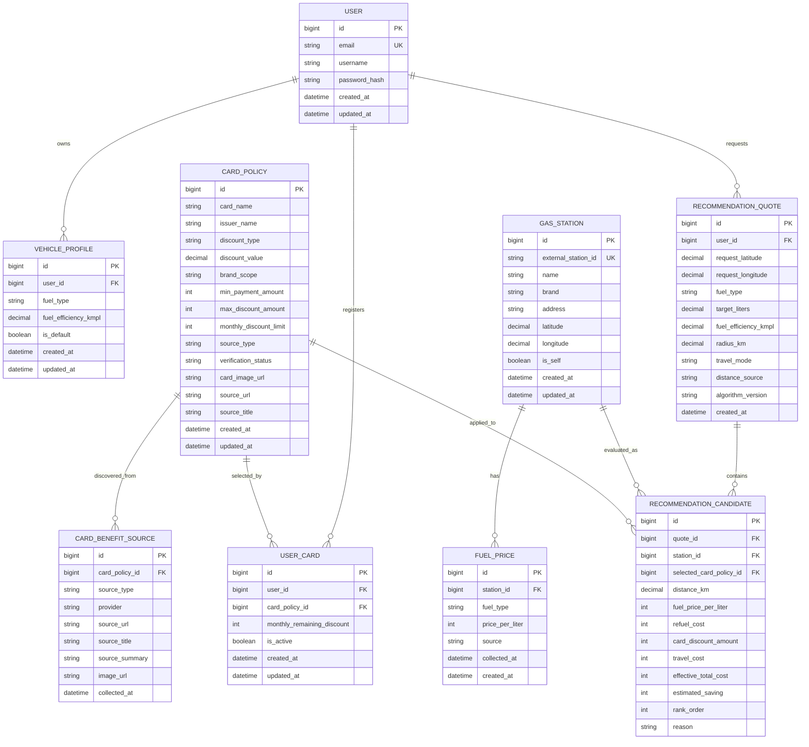

# SmartFuel ERD

This ERD describes the target data model for the SmartFuel greenfield implementation.

The model supports:

- user authentication
- vehicle fuel efficiency
- user-owned card discount policies
- card policy source and image metadata
- gas station and fuel price data
- recommendation quote history

## Domain Notes

`USER` belongs to the `accounts` domain.

`VEHICLE_PROFILE` belongs to the `vehicles` domain.

`CARD_POLICY`, `USER_CARD`, and `CARD_BENEFIT_SOURCE` belong to the `cards` domain.

Card policies can be manually entered or discovered through Naver-based search. Naver-discovered policies remain suggestions until the user confirms or an admin verifies them.

`GAS_STATION`, `FUEL_PRICE`, `RECOMMENDATION_QUOTE`, and `RECOMMENDATION_CANDIDATE` belong to the `stations` domain.

For the first backend slice, only `GAS_STATION` and `FUEL_PRICE` are required.

Recommendation history tables can be implemented after the stateless recommendation API is stable.

For Slice 4, the minimum required card models are `CARD_POLICY` and `USER_CARD`. `CARD_BENEFIT_SOURCE` can be added when implementing Naver discovery.
