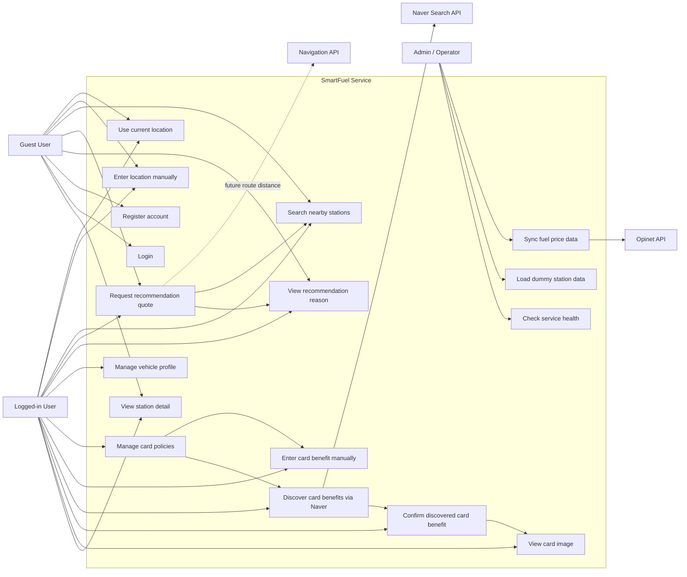

# SmartFuel Use Case Diagram

This diagram shows how users, external data providers, and operators interact with SmartFuel.



## Use Case Summary

| Actor | Main Goal | Use Cases |
|---|---|---|
| Guest User | Get a stateless recommendation | Current location, manual location, nearby station search, recommendation quote |
| Logged-in User | Get a personalized recommendation | Vehicle profile, manual card benefit input, Naver card discovery, card confirmation, recommendation quote |
| Admin / Operator | Keep service data and runtime healthy | Fuel price sync, dummy data load, health check |
| Opinet API | Provide fuel price data | Fuel price synchronization |
| Naver Search API | Provide card benefit discovery metadata | Card benefit candidate search |
| Navigation API | Provide route distance later | Future route-based distance calculation |

## Product Flow

```text
User location
-> nearby station candidate search
-> fuel price comparison
-> vehicle travel cost calculation
-> confirmed card discount calculation
-> effective total cost ranking
-> recommendation reason and card image display
```
