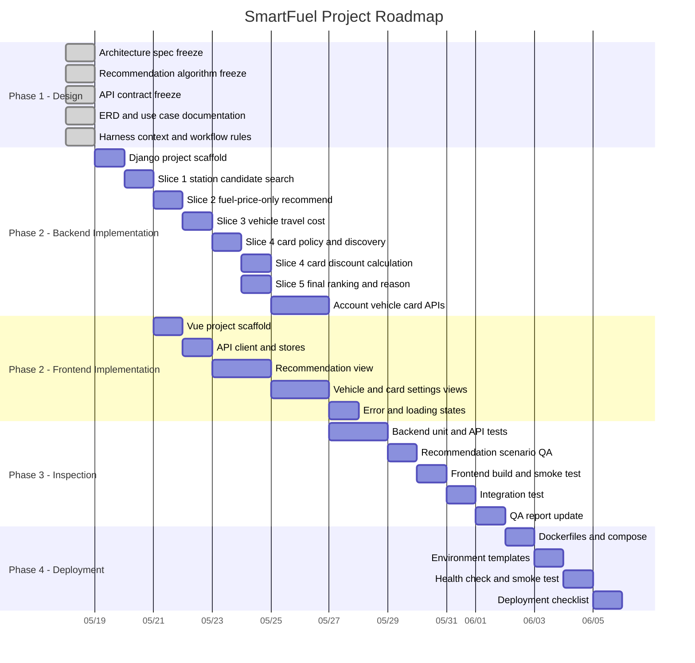

# SmartFuel Gantt Chart

This Gantt chart maps the current SmartFuel plan into the four project phases:

1. Design
2. Implementation
3. Inspection
4. Deployment

The schedule uses relative project days. Adjust the dates when the actual sprint start date changes.



## Milestones

| Milestone | Exit Criteria |
|---|---|
| Design Complete | Architecture, API, algorithm, ERD, use case, and harness rules are documented |
| Backend MVP | Recommendation API returns ranked station candidates from dummy data |
| Personalized Recommendation | Vehicle efficiency and card discounts affect final ranking |
| Frontend MVP | User can request and view recommendation with cost breakdown |
| Inspection Complete | API tests, scenario QA, frontend build, and integration smoke test pass |
| Deployment Ready | Docker Compose, `.env.example`, health check, and deployment checklist are ready |

## Progressive Implementation Guardrail

Do not implement all recommendation logic at once.

Follow the slice order from `harness/workflows.md`:

```text
candidate search
-> fuel-price-only recommendation
-> vehicle travel cost
-> card discount
-> final ranking
-> explanation response
-> frontend display
```
