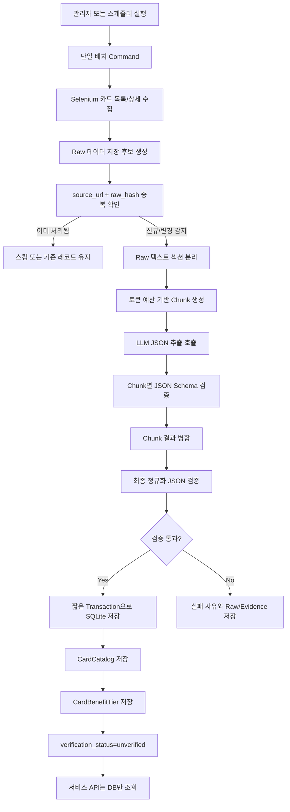
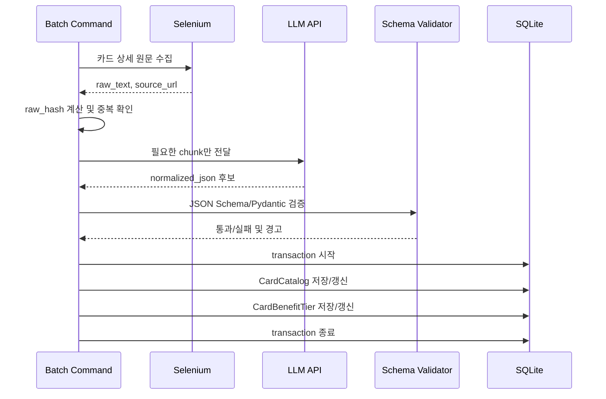
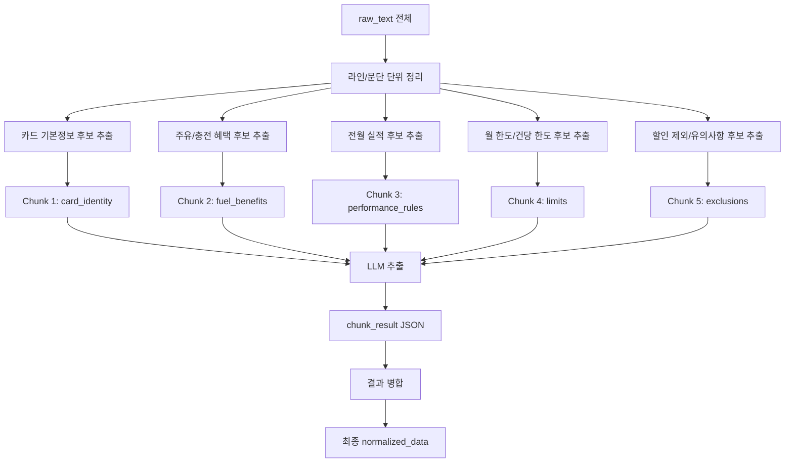
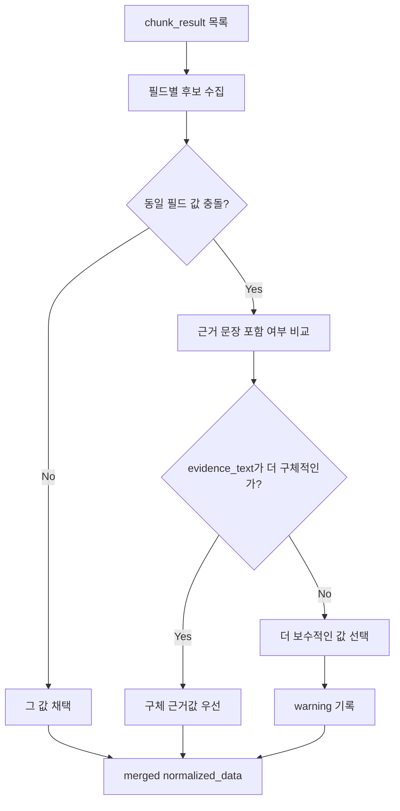
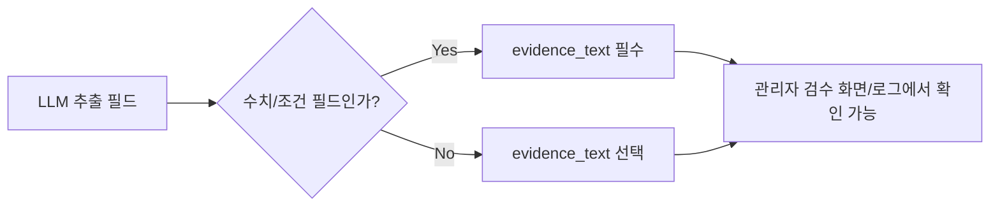
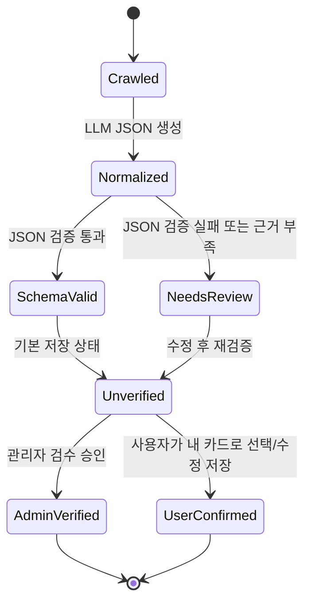
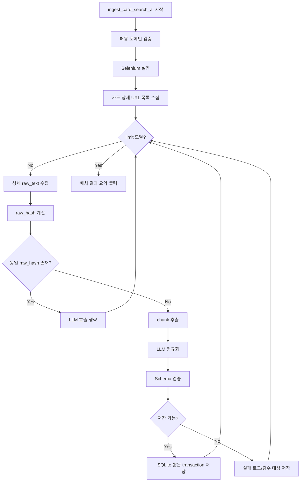

# SmartFuel 카드 AI 배치 정규화 설계안

## 1. 설계 목적

이 문서는 네이버 카드 검색/상세 URL에서 Selenium으로 수집한 카드 원문 데이터를 생성형 AI API로 정규화하여, SQLite 기반 카드 데이터베이스를 구축하는 배치 파이프라인 설계안입니다.

전제 조건은 다음과 같습니다.

- 별도 API 서버 통신 경로는 고려하지 않는다.
- 서비스 요청 중 실시간 크롤링/LLM 호출을 하지 않는다.
- SQLite를 계속 사용한다.
- DB write는 단일 배치 writer가 순차적으로 수행한다.
- LLM 결과는 기본적으로 `unverified`로 저장한다.
- 추천 알고리즘 반영 전에는 관리자 또는 사용자 확인 단계를 둔다.

---

## 2. 최종 판정 및 선결 조건

### 2.1 최종 판정

설계안의 전체 아키텍처 방향은 현행 코드베이스와 일관적이며, SQLite 제약 조건을 올바르게 다룬다. 구현 진행 가능.

### 2.2 구현 전 반드시 해소해야 할 사항

1. **Auto-verify 로직 충돌 해소**
   - 현행 `save_candidates()`에는 `confidence >= 0.85 -> ADMIN_VERIFIED` 자동 승인 로직이 있다.
   - 본 설계의 기본 정책은 AI 정규화 결과를 `unverified`로 저장하는 것이다.
   - 신규 AI 배치 명령은 기존 `save_candidates()` 저장 경로를 그대로 사용하지 않는다.
   - 구현안은 둘 중 하나로 확정한다.
     - 권장: `save_ai_normalized_candidate()` 같은 별도 저장 경로를 만든다.
     - 대안: 기존 `save_candidates(..., auto_verify=False)` 플래그를 추가하고 AI 배치에서는 반드시 `False`로 호출한다.

2. **`raw_hash` 필드 추가 확정**
   - 중복 방지와 LLM 재호출 회피의 핵심이므로 검토 항목이 아니라 필수 마이그레이션으로 확정한다.
   - `CardCatalog`에 다음 필드를 추가한다.

```python
raw_hash = models.CharField(max_length=80, blank=True, db_index=True)
```

### 2.3 구현 초기에 결정해야 할 사항

1. LLM 서비스/모델 선택 및 `requirements.txt` 반영 방식
2. 기존 `ThreadPoolExecutor` 수집 경로(`cards/views.py`)와의 공존/대체 방침
3. chunk 병합 시 충돌 해결 규칙
4. AI 정규화 대상 범위: 주유/충전 혜택만인지, 카드 전체 혜택인지

---

## 3. 권장 전체 구조



핵심은 `Selenium + LLM + DB 저장`을 사용자 요청 처리 경로에서 분리하고, 배치 명령 하나가 순차적으로 처리하도록 만드는 것이다.

---

## 4. SQLite 고정 조건에서의 처리 원칙

SQLite는 읽기 중심 서비스와 소규모 배치에는 사용할 수 있지만, 동시 write에는 취약하다. 따라서 다음 원칙을 지킨다.

### 4.1 허용되는 방식

```text
manage.py ingest_card_search_ai
  -> 카드 1장 수집
  -> 카드 1장 LLM 정규화
  -> 카드 1장 schema 검증
  -> 짧은 transaction으로 저장
  -> 다음 카드 처리
```

### 4.2 피해야 할 방식

```text
여러 worker가 동시에 CardCatalog 업데이트
ThreadPoolExecutor로 여러 Selenium/LLM 결과를 동시에 저장
사용자 API 요청 중 Selenium + LLM + SQLite write 수행
긴 transaction 안에서 LLM API 호출 대기
```

### 4.3 SQLite 저장 경계



LLM API 호출 중에는 DB transaction을 열어두지 않는다.

---

## 5. 토큰 Limit 대응 설계

카드 상세 페이지의 원문 전체를 LLM에 그대로 보내는 방식은 권장하지 않는다. 할인 제외 대상, 전월 실적, 월 한도 같은 핵심 조건이 뒤쪽에 있을 수 있기 때문이다.

따라서 “단순 요약”이 아니라 “규칙 기반 후보 문단 추출 + chunk별 구조화 + 병합” 방식을 사용한다.



### 5.1 Chunk 생성 기준

우선순위가 높은 키워드 주변 문단만 LLM에 보낸다.

- 카드 식별: `카드명`, `issuer`, `연회비`, `국내`, `해외`
- 주유/충전 혜택: `주유`, `충전`, `리터당`, `LPG`, `전기차`, `휘발유`, `경유`
- 실적 조건: `전월`, `직전`, `실적`, `이용금액`, `30만원`, `40만원`
- 한도 조건: `월`, `통합한도`, `할인한도`, `건당`, `1회`, `최대`
- 제외 조건: `제외`, `무이자`, `상품권`, `세금`, `공과금`, `아파트관리비`
- 유의사항: `유의사항`, `변경`, `중복`, `적용 기준`

### 5.2 Chunk별 LLM 역할

각 chunk는 전체 카드를 완성하려고 하지 않고, 자기 범위의 필드만 추출한다.

```text
card_identity chunk       -> 카드명, 카드사, 연회비, source title
fuel_benefits chunk       -> 주유/충전 할인 유형, 할인값, 유종, 브랜드 범위
performance_rules chunk   -> 전월 실적 구간
limits chunk              -> 월 한도, 건당 한도, 최소 결제금액
exclusions chunk          -> 할인 제외 조건, 주의 문구
```

---

## 6. Chunk 병합 및 충돌 해결 규칙

chunk별 결과가 서로 충돌할 수 있으므로 병합 규칙을 명시한다.



충돌 해결 기본값은 다음과 같다.

| 충돌 필드 | 우선 규칙 |
|---|---|
| `discount_value` | 주유/충전 문맥에 가장 가까운 evidence 우선 |
| `discount_type` | `per_liter`, `percentage`, `fixed_amount` 중 evidence가 명확한 값 우선 |
| `min_performance_amount` | 더 높은 실적 조건을 보수적으로 선택 |
| `monthly_discount_limit` | 더 낮은 한도를 보수적으로 선택 |
| `brand_scope` | 특정 브랜드 evidence가 있으면 특정 브랜드 우선, 없으면 `all` |
| `exclusions` | 병합 시 삭제하지 않고 누적 |

충돌이 있었던 필드는 `quality.warnings`에 기록한다.

---

## 7. 정규화 JSON 권장 형식

현재 `CardCatalog.normalized_data` 필드를 유지하되, AI 정규화용 `schema_version=2`를 사용한다.

```json
{
  "schema_version": 2,
  "provider": "naver_card_search",
  "normalizer": {
    "type": "llm",
    "model": "<model-name>",
    "normalized_at": "2026-06-23T00:00:00+09:00"
  },
  "source": {
    "url": "https://card-search.naver.com/item?cardAdId=...",
    "title": "카드 상세 페이지 제목",
    "raw_hash": "sha256:...",
    "collected_at": "2026-06-23T00:00:00+09:00"
  },
  "card": {
    "name": "카드명",
    "issuer": "카드사",
    "annual_fee": {
      "domestic": 10000,
      "overseas": 12000,
      "currency": "KRW"
    }
  },
  "benefits": [
    {
      "category": "fuel",
      "fuel_type": "ALL",
      "discount_type": "per_liter",
      "discount_value": 60,
      "brand_scope": "all",
      "min_performance_amount": 300000,
      "min_payment_amount": null,
      "max_discount_amount": null,
      "monthly_discount_limit": 20000,
      "evidence_text": "주유소/충전소 리터당 60원 청구할인, 월 통합 할인한도 2만원"
    }
  ],
  "exclusions": [
    {
      "type": "discount_exclusion",
      "text": "무이자할부 이용금액은 할인 제외",
      "evidence_text": "무이자할부 이용금액은 할인서비스 제외 대상입니다."
    }
  ],
  "quality": {
    "extraction_confidence": 0.82,
    "evidence_coverage": "partial",
    "warnings": ["monthly_limit_found", "exclusions_partial"]
  }
}
```

---

## 8. Evidence 저장 원칙

LLM이 추출한 모든 핵심 수치에는 원문 근거를 같이 저장한다.



Evidence가 필요한 필드 예시는 다음과 같다.

- `discount_value`
- `discount_type`
- `brand_scope`
- `min_performance_amount`
- `min_payment_amount`
- `monthly_discount_limit`
- `exclusions`

Evidence가 없거나 애매하면 저장은 가능하지만, `warnings`에 남기고 `verification_status=unverified`를 유지한다.

---

## 9. verification_status 정책

AI 정규화 결과는 기본적으로 검증 완료 데이터가 아니다.



권장 정책:

- LLM 결과만으로 `admin_verified`를 자동 부여하지 않는다.
- `confidence`는 자동 승인 근거가 아니라 검수 우선순위 판단용으로만 사용한다.
- 추천 알고리즘은 기존 정책처럼 `user_confirmed` 또는 `admin_verified` 데이터만 사용한다.
- 신규 AI 배치 저장 경로는 기존 `confidence >= 0.85 -> ADMIN_VERIFIED` 로직을 우회하거나 비활성화해야 한다.

---

## 10. confidence 의미 재정의

현재 코드의 `confidence`는 LLM 확률값이 아니라, 휴리스틱 파서가 계산한 내부 신뢰도 점수다.

AI 정규화 도입 후에는 다음처럼 의미를 분리한다.

| 필드 | 의미 | 추천 사용처 |
|---|---|---|
| `confidence` | 기존 DB 호환용 신뢰도 점수 | 목록 정렬/검수 우선순위 |
| `quality.extraction_confidence` | LLM 추출 결과의 자체 품질 점수 | 관리자 검수 참고 |
| `quality.evidence_coverage` | 원문 근거가 충분한지 | 자동 반영 차단/경고 |
| `verification_status` | 서비스에서 신뢰 가능한 상태인지 | 추천 알고리즘 반영 여부 |

중요한 기준은 `confidence`가 아니라 `verification_status`다.

---

## 11. 배치 Command 처리 흐름



배치 결과에는 최소한 다음 값이 필요하다.

```text
collected_count
normalized_count
saved_count
skipped_unchanged_count
schema_failed_count
llm_failed_count
review_required_count
```

---

## 12. 구현 시 파일 영향 예상

```text
backend/cards/models.py
  - CardCatalog.raw_hash 필수 추가

backend/cards/migrations/0007_cardcatalog_raw_hash.py
  - raw_hash 필드 마이그레이션

backend/cards/management/commands/ingest_card_search_ai.py
  - 신규 배치 command

backend/cards/selenium_ingestion.py
  - raw 수집/상세 텍스트 추출 함수 재사용 또는 분리
  - 기존 save_candidates 자동 승인 로직과 AI 저장 경로 분리

backend/cards/ai_normalization.py
  - chunk 생성, LLM 호출, JSON 검증, merge 담당

backend/cards/tests_ai_normalization.py
  - raw_hash, chunk 생성, schema 검증, 저장 정책 테스트
```

SQLite 고정 조건에서는 DB schema 변경을 최소화하되, `raw_hash`는 필수 필드로 추가한다. AI 정규화 메타데이터는 우선 `normalized_data` 내부에 넣는다.

---

## 13. 기존 ThreadPool 수집 경로 처리 방침

현재 `cards/views.py`의 `POST /cards/discovery/`는 in-process `ThreadPoolExecutor`로 수집을 시작할 수 있다. AI 정규화 배치와 동시에 유지하면 저장 정책이 갈라질 수 있으므로 구현 초기에 방침을 확정한다.

권장 방침:

```text
- 사용자 API 경로: DB 조회와 태스크 상태 조회만 담당
- 실제 수집/정규화/저장: management command 또는 scheduler만 담당
- AI 배치 저장: 기본 unverified 정책 고정
```

대체 방침:

```text
- POST /cards/discovery/는 deprecated 처리
- 운영/시연에서는 ingest_card_search_ai command만 사용
```

---

## 14. 구현 전 확정 체크리스트

1. LLM 서비스/모델 선택
2. LLM 클라이언트 의존성의 `requirements.txt` 반영 방식
3. AI 정규화 대상 범위: 주유/충전 혜택만 또는 카드 전체 혜택
4. 기존 `ThreadPoolExecutor` 경로의 유지/비활성화/대체
5. `confidence >= 0.85` 자동 승인 로직 제거 또는 `auto_verify=False` 분기
6. `raw_hash` 필수 마이그레이션 적용
7. chunk 병합 충돌 규칙 테스트 케이스 작성
8. LLM 실패 시 raw만 저장할지, 저장 자체를 실패 처리할지 결정

---

## 15. 결론

SQLite를 유지하는 조건에서는 단일 배치 writer 방식이 가장 안전하다.

추천 최종 방향은 다음과 같다.

```text
Selenium raw 수집
 -> source_url/raw_hash 기반 중복 방지
 -> 규칙 기반 chunk 추출
 -> LLM chunk별 JSON 정규화
 -> schema 검증 및 evidence 저장
 -> SQLite에 순차 저장
 -> 기본 unverified
 -> 서비스 API는 DB만 조회
```

이 구조는 실시간 API 지연, SQLite lock, LLM 토큰 초과, AI 환각으로 인한 추천 오염을 동시에 줄이는 방향이다.
