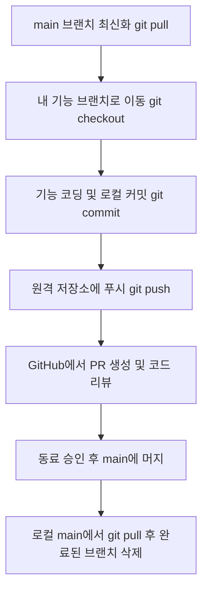

# Git 브랜치 전략 및 커밋 메시지 협업 가이드라인

본 문서는 **SmartFuel** 프로젝트의 2인 협업을 효율적으로 진행하기 위한 Git 브랜치 관리 및 커밋 메시지 표준 규칙을 정의합니다.

---

## 1. 브랜치 구성 및 역할 (총 6개)

기능 개발 브랜치는 고정되어 있지 않고 개발 완료(Merge) 시 삭제한 후 다음 기능 개발 시 새로 만드는 방식으로 유연하게 관리합니다.

| 브랜치명 | 구분 | 역할 |
| :--- | :--- | :--- |
| **`main`** | 고정 (중심) | 항상 정상 작동하는 완성본 및 데모용 브랜치 |
| **`feat/front-base`** | 기능 (임시) | 프론트엔드 Vue 3 초기 설정, 네이버 지도 API 연동 등 프론트 뼈대 개발 |
| **`feat/accounts`** | 기능 (임시) | Django REST Framework 기반 로그인, 회원가입, JWT 인증 개발 |
| **`feat/stations-api`** | 기능 (임시) | 오피넷 API 연동, 주유소 데이터 DB 적재, FastAPI 검색 사이드카 개발 |
| **`feat/front-features`** | 기능 (임시) | 주유소 검색, 마커 표시, 필터, 상세 모달 등 프론트 UI 기능 구현 |
| **`feat/card-vehicle`** | 기능 (임시) | 사용자 차량 연비 관리, 신용카드 할인 혜택 매칭 백엔드 로직 개발 |

---

## 2. 일상 협업 프로세스 (Git 작업 수명 주기)

매일 작업을 시작하고 끝마칠 때 다음 순서대로 명령어를 사용합니다.



### 상세 명령어 가이드
1. **작업 시작 전 최신 코드 가져오기**
   ```bash
   git checkout main
   git pull origin main
   git checkout <내_기능_브랜치명>
   ```
2. **개발 진행 및 로컬 커밋**
   ```bash
   git add .
   git commit -m "feat(범위): 구체적인 변경 내용"
   ```
3. **원격 저장소 업로드**
   ```bash
   git push origin <내_기능_브랜치명>
   ```
4. **Pull Request (PR) 및 병합**
   * GitHub에서 **Base: `main` <- Compare: `내_기능_브랜치`**로 PR을 생성합니다.
   * 팀원의 코드 리뷰 및 승인을 얻은 후 `Merge pull request`를 실행합니다.
5. **로컬 브랜치 정리**
   ```bash
   git checkout main
   git pull origin main
   git branch -d <개발_완료된_브랜치명>
   ```

---

## 3. 커밋 메시지 표준 양식 (Conventional Commits)

커밋 내역의 가독성을 높이기 위해 모든 팀원은 아래 규칙을 엄격히 준수합니다.

### 템플릿
```text
타입(범위): 구체적인 작업 내용 (한글 작성)
```
*예시: `feat(accounts): 회원가입 API 유효성 검사 추가`*

### 필수 커밋 타입 (Type)

| 타입 | 용도 | 예시 |
| :--- | :--- | :--- |
| **`feat`** | 새로운 기능 추가 | `feat(stations): 주유소 정보 필터링 기능 추가` |
| **`fix`** | 버그 및 에러 수정 | `fix(accounts): 로그인 비밀번호 대소문자 예외 처리` |
| **`docs`** | 문서 작성 및 수정 (README.md, 주석 등) | `docs(readme): API 명세서 링크 업데이트` |
| **`style`** | 코드 가독성 조정 (eslint, 포맷팅, 세미콜론 수정 등) | `style(front): Prettier 일괄 적용` |
| **`refactor`** | 기능 추가 없는 코드 구조 및 가독성 개선 | `refactor(stations): 주유소 추천 알고리즘 함수 분할` |
| **`chore`** | 패키지 설치, 환경변수 설정 등 기타 변경사항 | `chore(env): DRF CORS 허용 도메인 추가` |

---

## 4. 예외 상황 (Merge Conflict) 해결 가이드

두 사람이 같은 파일의 같은 위치를 동시에 수정하여 PR 병합이 불가능할 경우 대처법입니다.

### 로컬에서 충돌 해결하기
1. 내 기능 브랜치로 이동한 후 `main` 브랜치를 합쳐봅니다.
   ```bash
   git checkout <내_기능_브랜치명>
   git merge main
   ```
2. 에디터(VS Code 등)에서 충돌이 발생한 파일을 엽니다.
3. 충돌 표시 영역(`<<<<<<< HEAD`와 `>>>>>>> main` 사이)을 확인하고, 알맞은 코드를 선택하거나 직접 코드를 정리합니다.
4. 수정이 끝나면 다시 저장한 후 커밋 및 푸시를 진행합니다.
   ```bash
   git add .
   git commit -m "fix: main 브랜치 병합 충돌 해결"
   git push origin <내_기능_브랜치명>
   ```
5. GitHub의 PR 페이지로 돌아가 충돌 경고가 해제되었는지 확인하고 머지합니다.
